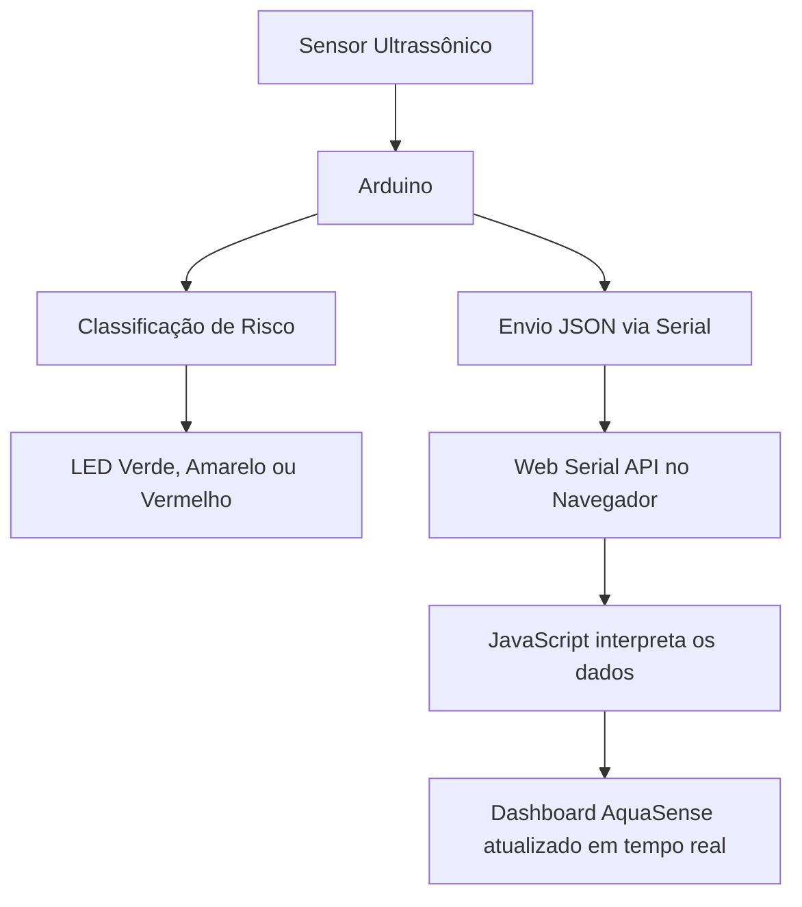

# 💧 AquaSense — Monitoramento Inteligente de Nível da Água


---

## 📌 Sobre o Projeto

O **AquaSense** é um protótipo acadêmico de **monitoramento hídrico em tempo real**, desenvolvido para demonstrar como sensores de baixo custo, Arduino e uma interface web moderna podem ser utilizados na **prevenção de enchentes** e no apoio à tomada de decisão em áreas de risco.

O sistema utiliza um **sensor ultrassônico conectado ao Arduino** para medir a distância até a superfície monitorada. Esses dados são enviados para um website por meio da **Web Serial API**, permitindo que o dashboard seja atualizado automaticamente com informações de nível, status, risco e horário da última leitura.

A proposta está alinhada ao **ODS 11 — Cidades e Comunidades Sustentáveis**, buscando aplicar tecnologia acessível para tornar comunidades mais seguras, resilientes e inteligentes.

---

## 🎯 Objetivo

Criar uma solução simples, visual e funcional para acompanhar o nível da água em tempo real, classificando automaticamente o risco em três estados principais:

|       Distância medida | Status  | Risco | Indicação   |
| ---------------------: | ------- | ----: | ----------- |
|        Maior que 18 cm | Seguro  |   1/5 | 🟢 Verde    |
|    Entre 11 cm e 18 cm | Atenção |   3/5 | 🟡 Amarelo  |
| Menor ou igual a 10 cm | Perigo  |   5/5 | 🔴 Vermelho |

---

## ✨ Funcionalidades

* 📡 Leitura de dados em tempo real via Arduino.
* 🌊 Monitoramento de distância/nível em centímetros.
* 🚦 Classificação automática de risco.
* 💡 Acionamento de LEDs físicos conforme o status.
* 🔌 Conexão direta entre navegador e Arduino usando Web Serial API.
* 📊 Dashboard visual com cards, barras e indicadores.
* 🕐 Exibição da última leitura recebida.
* 📱 Layout responsivo para desktop, tablet e celular.
* 🎨 Interface moderna com estética limpa, tecnológica e sustentável.

---

## 🧠 Como o Sistema Funciona



O Arduino coleta a distância usando o sensor ultrassônico, classifica o risco e envia uma mensagem JSON para o navegador.

Exemplo de dado enviado:

```json
{"distancia":15,"status":"Atencao","risco":3}
```

O JavaScript recebe essa mensagem, interpreta o JSON e atualiza os elementos visuais do painel.

---

## 🧰 Tecnologias Utilizadas

### Front-end

* **HTML5** — estrutura da página.
* **CSS3** — estilização, responsividade e animações.
* **JavaScript** — lógica do dashboard e comunicação serial.
* **Web Serial API** — leitura dos dados enviados pelo Arduino.

### Hardware

* **Arduino Uno ou compatível**.
* **Sensor ultrassônico HC-SR04** ou similar.
* **LED verde**.
* **LED amarelo**.
* **LED vermelho**.
* **Resistores**.
* **Protoboard**.
* **Jumpers**.
* **Cabo USB com suporte a dados**.

### Ferramentas

* Arduino IDE.
* Visual Studio Code.
* Google Chrome ou Microsoft Edge.
* Live Server ou servidor local equivalente.

---

## 📁 Estrutura do Projeto

```text
AquaSense/
├── index.html
├── README.md
└── src/
    ├── style.css
    └── script-real.js
```

### Descrição dos arquivos

| Arquivo              | Descrição                                             |
| -------------------- | ----------------------------------------------------- |
| `index.html`         | Estrutura principal da aplicação web                  |
| `src/style.css`      | Estilos visuais, responsividade e animações           |
| `src/script-real.js` | Lógica de conexão com Arduino e atualização do painel |
| `README.md`          | Documentação do projeto para GitHub                   |

---

## 🔌 Ligações do Arduino

| Componente                     | Pino no Arduino |
| ------------------------------ | --------------: |
| Trigger do sensor ultrassônico |              13 |
| Echo do sensor ultrassônico    |              12 |
| LED vermelho                   |               5 |
| LED verde                      |               6 |
| LED amarelo                    |               7 |

> Recomenda-se utilizar resistores nos LEDs para evitar danos aos componentes.

---

## ⚙️ Código Arduino

```cpp
int echoPino = 12;
int trigPino = 13;

int LED_VERMELHO = 5;
int LED_VERDE    = 6;
int LED_AMARELO  = 7;

long duracao   = 0;
long distancia = 0;

void setup() {
  Serial.begin(9600);

  pinMode(echoPino, INPUT);
  pinMode(trigPino, OUTPUT);

  pinMode(LED_VERMELHO, OUTPUT);
  pinMode(LED_VERDE, OUTPUT);
  pinMode(LED_AMARELO, OUTPUT);

  digitalWrite(LED_VERMELHO, LOW);
  digitalWrite(LED_VERDE, LOW);
  digitalWrite(LED_AMARELO, LOW);
}

void loop() {
  digitalWrite(trigPino, LOW);
  delayMicroseconds(2);

  digitalWrite(trigPino, HIGH);
  delayMicroseconds(10);
  digitalWrite(trigPino, LOW);

  duracao = pulseIn(echoPino, HIGH);
  distancia = duracao / 58;

  String status = "";
  int risco = 1;

  digitalWrite(LED_VERMELHO, LOW);
  digitalWrite(LED_VERDE, LOW);
  digitalWrite(LED_AMARELO, LOW);

  if (distancia <= 10) {
    digitalWrite(LED_VERMELHO, HIGH);
    status = "Perigo";
    risco = 5;
  } else if (distancia <= 18) {
    digitalWrite(LED_AMARELO, HIGH);
    status = "Atencao";
    risco = 3;
  } else {
    digitalWrite(LED_VERDE, HIGH);
    status = "Seguro";
    risco = 1;
  }

  Serial.print("{\"distancia\":");
  Serial.print(distancia);
  Serial.print(",\"status\":\"");
  Serial.print(status);
  Serial.print("\",\"risco\":");
  Serial.print(risco);
  Serial.println("}");

  delay(1000);
}
```

---

## 🚀 Como Executar o Projeto

### 1. Clone o repositório

```bash
git clone https://github.com/cleciofjur/AquaSense.git
```

### 2. Acesse a pasta do projeto

```bash
cd AquaSense
```

### 3. Envie o código para o Arduino

1. Abra a **Arduino IDE**.
2. Cole o código Arduino.
3. Selecione a placa correta.
4. Selecione a porta correta.
5. Faça o upload para a placa.
6. Abra o Monitor Serial e confirme se as mensagens JSON estão aparecendo.

Exemplo esperado:

```json
{"distancia":24,"status":"Seguro","risco":1}
```

### 4. Abra o website localmente

Recomenda-se usar a extensão **Live Server** no VS Code.

Também é possível abrir o arquivo `index.html` diretamente, mas o uso de servidor local é mais recomendado.

### 5. Conecte o Arduino ao dashboard

1. Abra o projeto no **Google Chrome** ou **Microsoft Edge**.
2. Clique em **“Conectar Arduino”**.
3. Escolha a porta correspondente ao Arduino.
4. Aguarde as leituras aparecerem no painel.

---

## 🌐 Compatibilidade

A comunicação com Arduino depende da **Web Serial API**.

| Navegador      | Suporte                      |
| -------------- | ---------------------------- |
| Google Chrome  | ✅ Compatível                 |
| Microsoft Edge | ✅ Compatível                 |
| Firefox        | ❌ Não compatível nativamente |
| Safari         | ❌ Não compatível nativamente |

---

## 🧪 Testes Realizados

* ✅ Leitura do sensor ultrassônico.
* ✅ Envio de dados JSON pela porta serial.
* ✅ Conexão entre navegador e Arduino.
* ✅ Atualização do nível em centímetros no dashboard.
* ✅ Alteração automática do status de risco.
* ✅ Acionamento dos LEDs conforme a distância.
* ✅ Interface responsiva em diferentes tamanhos de tela.

---

## 🛠️ Possíveis Problemas e Soluções

### O Arduino não aparece na lista de portas

Verifique:

* Se o cabo USB suporta transferência de dados.
* Se a Arduino IDE não está com o Monitor Serial aberto.
* Se a placa foi reconhecida pelo sistema.
* Se o navegador tem permissão para acessar a porta.

### O navegador não conecta ao Arduino

Use **Google Chrome** ou **Microsoft Edge**. Outros navegadores podem não oferecer suporte à Web Serial API.

### Os dados aparecem quebrados ou ilegíveis

Confirme se o baud rate é o mesmo no Arduino e no JavaScript.

Arduino:

```cpp
Serial.begin(9600);
```

JavaScript:

```js
await port.open({ baudRate: 9600 });
```

### O painel não atualiza

Verifique:

* Se o arquivo `script-real.js` está sendo carregado corretamente.
* Se o botão possui o ID `btn-conectar-arduino`.
* Se o Arduino está enviando JSON válido.
* Se há erros no Console do navegador.

---

## 🔮 Melhorias Futuras

* [ ] Adicionar gráfico histórico das leituras.
* [ ] Criar botão para desconectar Arduino.
* [ ] Salvar dados em banco de dados ou planilha.
* [ ] Enviar alertas por WhatsApp, Telegram ou e-mail.
* [ ] Adicionar mais sensores ao sistema.
* [ ] Implementar média móvel para reduzir ruídos de leitura.
* [ ] Criar versão com ESP32 e Wi-Fi.
* [ ] Criar painel administrativo para múltiplos sensores.
* [ ] Publicar uma versão demonstrativa online.

---

## 🌱 Relação com ODS 11

O projeto se relaciona com o **Objetivo de Desenvolvimento Sustentável 11 — Cidades e Comunidades Sustentáveis**, pois propõe uma solução tecnológica acessível para apoiar cidades mais resilientes, seguras e preparadas para situações de risco ambiental.

O AquaSense demonstra como a integração entre sensores, dados e interfaces digitais pode contribuir para ações preventivas em comunidades vulneráveis a enchentes.

---

## 👨‍💻 Autor

Desenvolvido por **Clecio Júnior**.

* GitHub: [@cleciofjur](https://github.com/cleciofjur)
* LinkedIn: [Clecio Júnior](https://www.linkedin.com/in/clecio-j%C3%BAnior-58b643327/)

---

## 📄 Licença

Este projeto é de caráter acadêmico e pode ser utilizado para fins de estudo, pesquisa e demonstração.

Caso deseje, você pode adicionar uma licença formal ao repositório, como:

* MIT License;
* Creative Commons para documentação acadêmica.

---

## 💧 AquaSense

> Tecnologia acessível para monitorar riscos, proteger comunidades e transformar dados em prevenção.
